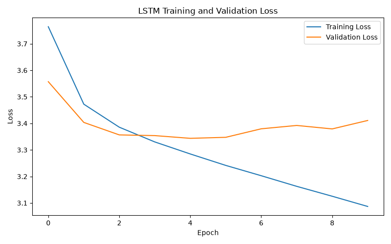

# Generating Music with Machine Learning

An LSTM that learns note-sequence patterns from piano MIDI and generates new music, one note at a time.

**UE24CS352A — Machine Learning · Mini-Project**

| Deliverable | File |
|---|---|
| Full technical report (PDF) | [`docs/Project_Report.pdf`](docs/Project_Report.pdf) |
| Presentation deck | [`docs/Music_Generation_ML_Presentation.pptx`](docs/Music_Generation_ML_Presentation.pptx) |

---

## Table of contents

- [Problem statement](#problem-statement)
- [Dataset](#dataset)
- [Methodology](#methodology)
- [Model](#model)
- [Project structure](#project-structure)
- [Setup](#setup)
- [Running the project](#running-the-project)
- [Results](#results)
- [Known issues](#known-issues)
- [Troubleshooting](#troubleshooting)
- [Limitations](#limitations)
- [Future work](#future-work)
- [Conclusion](#conclusion)
- [References](#references)

---

## Problem statement

Given a sequence of musical notes extracted from MIDI files, train a model to predict the next note, then apply that
prediction repeatedly to compose a new sequence that can be written back out as playable music.

Formally the model estimates `P(n_t | n_{t-50}, ..., n_{t-1})` — an 88-way classification over pitch classes,
conditioned on a fixed 50-note context window.

**Scope.** The model predicts **pitch only**. Note duration is fixed at an eighth note when the MIDI is written, and
velocity is discarded. This is a deliberate simplification that keeps the task tractable on CPU within a one-week
budget; see [Limitations](#limitations).

## Dataset

[MAESTRO v3.0.0](https://magenta.tensorflow.org/datasets/maestro) (MIDI-only distribution) — aligned virtuosic piano
performances. This project uses a **20-file subset**, chosen so a full training run finishes in about ten minutes on a
laptop CPU.

| Quantity | Value | How it is derived |
|---|---:|---|
| MIDI performances | 20 | Files matched by `data/raw/**/*.midi` |
| Notes extracted | 82,157 | Every `Note` at pitch; every `Chord` reduced to one pitch |
| Unique pitch classes | 88 | Distinct pitch strings, sorted, indexed from 0 |
| Context window | 50 | Fixed hyper-parameter |
| Supervised examples | 82,107 | 82,157 − 50, stride 1 |
| Training sequences | 73,896 | First 90% of the window list |
| Validation sequences | 8,211 | Final 10% of the window list |

The vocabulary size of 88 coincides with the number of keys on a piano. That is a property of this subset, not a
constraint in the code — the vocabulary is whatever distinct pitches the parser encounters.

**The MIDI files are not committed to this repository.** Download the MIDI-only MAESTRO archive and place your selected
`.midi` files in `data/raw/`. MAESTRO is distributed under CC BY-NC-SA 4.0.

## Methodology

```text
MIDI files (data/raw/*.midi)
   ↓  music21 parses and flattens each score
Note extraction  →  pitch strings
   ↓  sorted vocabulary, note → integer
Integer encoding
   ↓  sliding window, length 50, stride 1
Training sequences  (82,107 examples)
   ↓  one-hot → LSTM → linear → 88 logits
Next-note prediction  (cross-entropy)
   ↓  temperature softmax + multinomial sampling, ×200
200 generated notes
   ↓  music21 stream → MIDI
generated/generated_song.mid
```

Sampling, rather than taking the arg-max, is essential at generation time: greedy decoding on a model this size
collapses into a short repeating cycle within a handful of notes, because the arg-max of a peaked distribution is
self-reinforcing.

## Model

A single-layer LSTM followed by one linear head — about **123,000 parameters**.

| Parameter | Value |
|---|---:|
| Sequence length | 50 |
| Hidden size | 128 |
| LSTM layers | 1 |
| Output classes | 88 |
| Batch size | 64 |
| Epochs | 10 |
| Learning rate | 0.001 |
| Optimizer | Adam |
| Loss | Cross Entropy |
| Regularisation | None |

| Component | Shape | Parameters |
|---|---|---:|
| LSTM input-to-hidden | 4 × 128 × 88 | 45,056 |
| LSTM hidden-to-hidden | 4 × 128 × 128 | 65,536 |
| LSTM biases | 2 × 4 × 128 | 1,024 |
| Linear weights + bias | 88 × 128 + 88 | 11,352 |
| **Total** | | **122,968** |

## Project structure

```text
music-generation-ml/
├── data/
│   ├── raw/                  # MIDI input — git-ignored, you supply this
│   └── processed/            # notes.pkl — git-ignored
├── docs/
│   ├── Project_Writeup.pdf   # two-page write-up
│   ├── Project_Report.pdf    # full technical report
│   └── Music_Generation_ML_Presentation.pptx
├── generated/                # generated_song.mid — git-ignored
├── models/                   # music_lstm.pth — git-ignored
├── results/
│   └── training_loss.png
├── src/
│   ├── preprocess.py
│   ├── train.py
│   └── generate.py
├── .gitignore
├── requirements.txt
└── README.md
```

Every generated artifact and all input data are git-ignored, so the repository holds only source, documentation and the
one committed result figure. Each script runs on its own and depends only on the artifact the previous stage wrote,
which makes a failure easy to localise.

## Setup

### 1. Clone the repository

```bash
git clone https://github.com/hamsa646/music-generation-ml.git
cd music-generation-ml
```

### 2. Create and activate a virtual environment

```bash
python -m venv .venv
```

```bash
# Windows
.venv\Scripts\activate

# macOS / Linux
source .venv/bin/activate
```

### 3. Install dependencies

> **Before you run this:** `requirements.txt` is UTF-16 encoded and `pip` cannot read it, so this command fails as
> checked in. Convert the file to UTF-8 first — one command, see [Troubleshooting](#troubleshooting).

```bash
python -m pip install -r requirements.txt
```

The project needs **PyTorch (CPU build)**, **music21** and **matplotlib**. If the pinned CPU wheel does not resolve
from the default index, install PyTorch separately and then the rest:

```bash
pip install torch --index-url https://download.pytorch.org/whl/cpu
pip install music21 matplotlib
```

## Running the project

### Step 1 — Add MIDI files

Place `.midi` files inside `data/raw/`.

### Step 2 — Preprocess

```bash
python src/preprocess.py
```

Creates `data/processed/notes.pkl` and prints the file count, the total note count and the vocabulary size.

### Step 3 — Train

```bash
python src/train.py
```

Creates `models/music_lstm.pth` and `results/training_loss.png`, printing train and validation loss each epoch.

### Step 4 — Generate music

```bash
python src/generate.py
```

Creates `generated/generated_song.mid`. Open it in [MuseScore Studio](https://musescore.org/) to listen.

## Results

| Epoch | Training loss | Validation loss | Validation perplexity | |
|---:|---:|---:|---:|---|
| 1 | 3.7641 | 3.5570 | 35.1 | first pass over the corpus |
| 5 | 3.2860 | 3.3430 | 28.3 | **validation minimum** |
| 10 | 3.0868 | 3.4109 | 30.3 | **checkpoint that is saved** |



**Read the curve, not just the endpoints.**

- **The model learns real structure.** A uniform guess over 88 pitch classes costs `ln(88) = 4.477` nats. Validation
  loss reaches 3.343 at its best — a reduction of 1.13 nats, equivalent to narrowing 88 candidate notes to about 28
  effective choices.
- **The model overfits from epoch 5 onward.** Training loss keeps falling for all ten epochs while validation loss
  turns and rises by 0.068 nats. Everything after epoch 5 improves the fit to the training corpus at the expense of
  generalisation, and because `train.py` checkpoints the final epoch, **the saved model is the worse of the two**.
- **Perplexity 30 is a weak prior, not a composer.** The model has learned the pitch distribution and short-range
  intervallic habits of the corpus. It has not learned phrase structure, cadence or key, and with a fixed eighth-note
  duration it has no rhythm to learn at all.

The pipeline produces a valid 200-note MIDI file that opens and plays in MuseScore Studio.

> Epoch 1 and epoch 10 are logged values. Intermediate values are read from `results/training_loss.png` and are accurate
> to roughly ±0.005. The run was not seeded, so these figures describe one specific run.

## Known issues

Reviewing our own code turned up eight defects. **All eight are present in the source as it stands** — they are
listed here rather than quietly left for someone else to hit. D1 is the one to fix first: it blocks setup on any
clean machine and costs a single file re-save.

| ID | Finding | Class |
|---|---|---|
| D1 | `requirements.txt` is UTF-16 encoded, so `pip install -r` fails outright | Blocking |
| D2 | Training windows span unrelated performances (notes from all files are concatenated first) | Correctness |
| D3 | Train and validation windows overlap by up to 49 notes at the split boundary | Correctness |
| D4 | No random seed, so the reported figures cannot be reproduced exactly | Reproducibility |
| D5 | The last epoch is checkpointed rather than the best one | Quality |
| D6 | `MusicLSTM` is defined twice, in `train.py` and `generate.py` | Maintainability |
| D7 | Validation runs as one un-batched forward pass (~145 MB at this corpus size) | Scalability |
| D8 | Chord reduction takes `pitches[0]`, not the lowest pitch its comment claims | Correctness |

Section 6 of [`docs/Project_Report.pdf`](docs/Project_Report.pdf) gives the evidence for each finding, the remedy it
requires, and the order we would apply them in. Note that D2, D3, D5 and D8 each change what the model trains on or
which checkpoint is kept, so fixing them means regenerating the results reported above.

## Troubleshooting

**`pip install -r requirements.txt` fails with an encoding or parse error.**
This is D1 above. The file is UTF-16LE. Convert it in place:

```bash
# macOS / Linux
iconv -f UTF-16 -t UTF-8 requirements.txt -o requirements.utf8.txt && mv requirements.utf8.txt requirements.txt
```

```powershell
# Windows PowerShell
Get-Content requirements.txt | Set-Content -Encoding utf8 requirements.utf8.txt
Move-Item -Force requirements.utf8.txt requirements.txt
```

**`preprocess.py` reports `MIDI files found: 0`.**
`data/raw/` is empty, or the files use the `.mid` extension. The glob matches `*.midi` only — rename them, or widen the
pattern.

**`torch==...+cpu` cannot be resolved by pip.**
The pinned build is not on the default index. Use the separate PyTorch install command in [Setup](#setup).

**`train.py` raises an out-of-memory error.**
Validation runs as a single forward pass over the whole split (D7 above). Reduce the corpus size, or lower the
validation fraction, until validation is mini-batched.

## Limitations

| Limitation | Consequence for the output |
|---|---|
| Pitch-only encoding | Duration is fixed and velocity is absent, so the output has no rhythm and no dynamics — the most audible shortcoming |
| Chords reduced to one pitch | No harmony is learned or produced; the output is strictly monophonic |
| 50-note fixed context | No representation of phrase, section or key; structure beyond about six bars is impossible by construction |
| Small corpus | 20 of more than 1,200 available performances — directly responsible for the measured overfitting |
| Single fixed seed sequence | Generation always begins from the same 50 notes, so output diversity comes only from sampling noise |
| No evaluation beyond loss | Neither next-note accuracy nor human judgement was measured |
| Unseeded training run | The reported figures describe one specific run and cannot be reproduced exactly |

## Future work

Ordered by expected improvement per unit of effort.

1. **Model duration alongside pitch** — predict a `(pitch, duration)` pair, or add a second output head. Gives the
   output rhythm; the single largest perceptual gain available, and it needs no new data.
2. **Scale the corpus** — use several hundred MAESTRO performances instead of twenty. Attacks the measured overfitting
   directly; more data is the cheapest regulariser available here.
3. **Add regularisation and early stopping** — dropout between stacked LSTM layers, patience on validation loss.
   Removes the need to guess an epoch budget.
4. **Represent harmony** — multi-hot chord encoding or a piano-roll representation, for polyphonic output.
5. **Benchmark against a Transformer** — a small self-attention model on identical data, to test whether the fixed
   50-note context is the binding constraint.
6. **Run a listening study** — blind A/B against real MAESTRO excerpts. The only evaluation that measures the property
   the project actually cares about.

## Conclusion

The project delivers a complete, runnable pipeline for symbolic music generation — MIDI preprocessing, sequence
construction, LSTM training, next-note prediction and MIDI write-out — and a model that measurably beats a uniform
baseline on held-out data.

The more useful finding is the shape of the validation curve: a 123K-parameter model on 82K notes with no
regularisation reaches its generalisation optimum at epoch 5 and degrades for the remaining five. The limitations that
remain are consequences of explicit scope decisions rather than failures of the model, and each has a specific remedy
listed above.

## References

1. Hawthorne, C. et al. *Enabling Factorized Piano Music Modeling and Generation with the MAESTRO Dataset.* ICLR, 2019.
2. Hochreiter, S. and Schmidhuber, J. *Long Short-Term Memory.* Neural Computation, 9(8):1735–1780, 1997.
3. Cuthbert, M. S. and Ariza, C. *music21: A Toolkit for Computer-Aided Musicology and Symbolic Music Data.* ISMIR, 2010.
4. Paszke, A. et al. *PyTorch: An Imperative Style, High-Performance Deep Learning Library.* NeurIPS, 2019.
5. Project milestone: *Generating music with Machine Learning* — the reference write-up this mini-project is based on.
